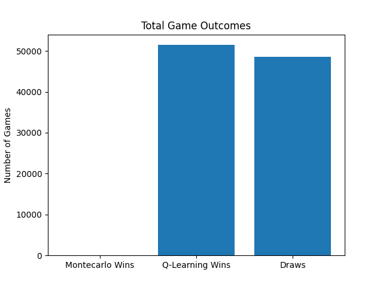
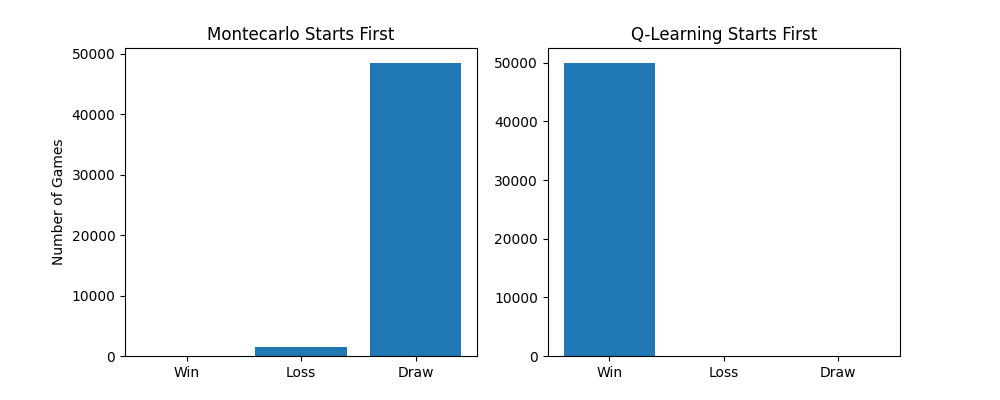
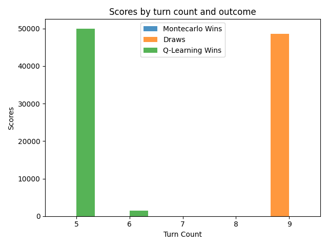
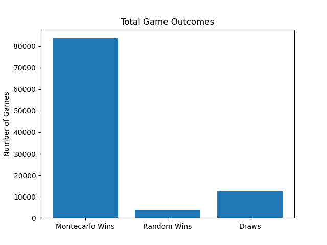
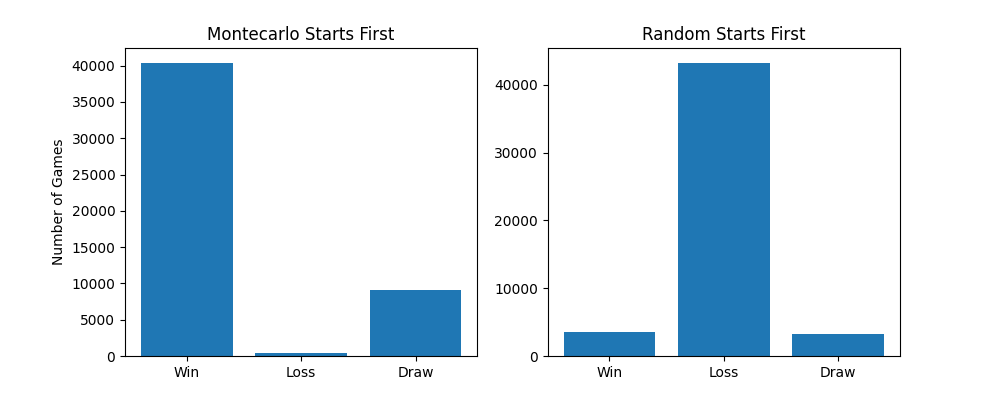
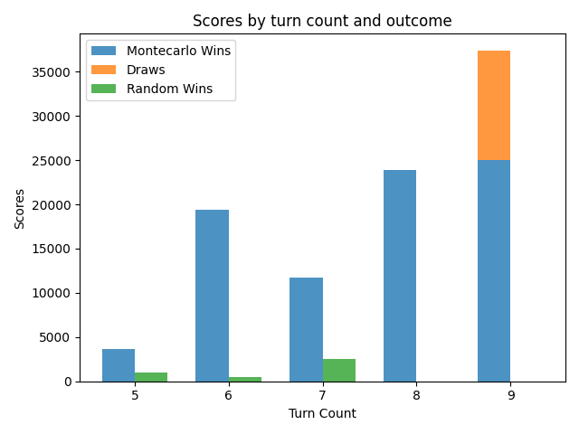
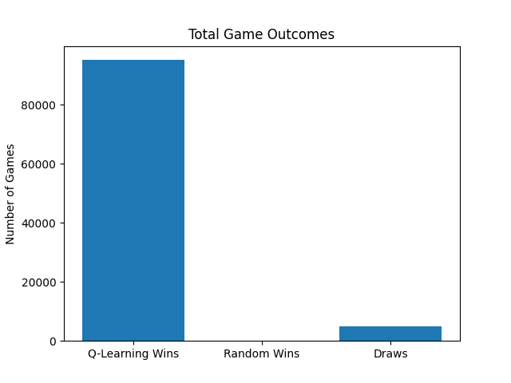
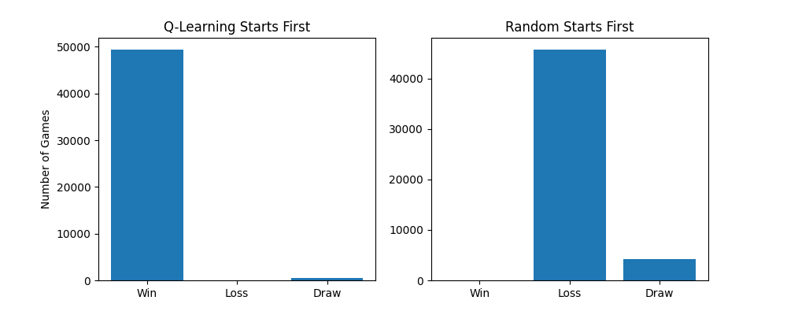
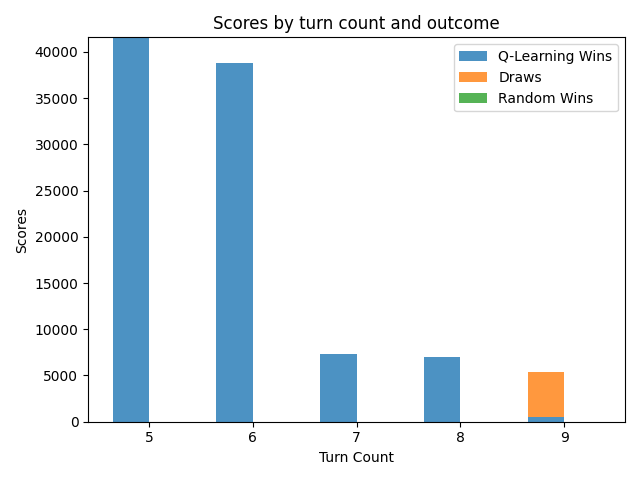

# Overview of Tic-Tac-Toe AI Implementation

This Python script presents an Reinforcement Learning implementation for the classic game of Tic-Tac-Toe, using two primary methods: Q-Learning and Monte Carlo simulations. It's designed to train AI models to play Tic-Tac-Toe, compete against each other, and even play against a human.

## Key Components

1. **State Definition**: A `State` named tuple defines the game state, holding positions of 'X' and 'O', and the current turn.
2. **Q-Learning Implementation**: Utilizes a reinforcement learning approach for training the AI.
3. **Monte Carlo Implementation**: Employs Monte Carlo methods for a different AI training approach.
4. **Game Simulation and Training**: Functions to simulate games, train the AI models, and evaluate the outcomes.
5. **Utility Functions**: Includes functions for printing the board, checking wins, and normalizing weights.
6. **Result Analysis**: Code to compete AIs against each other and analyze the results with various plots.

## Training Process

- The script trains two AI agents using Q-Learning and Monte Carlo methods over `10,000,000` episodes.
- Adjusts hyperparameters like `learning_rate` and `discount_factor` to optimize learning.

## Competing the AI Models

- The models compete in `100,000` games.
- Functions like `compete` and `update_results` manage these competitions and track the outcomes.

## Results and Visualization

- The script includes functions to plot the outcomes of the competitions, such as win/loss/draw ratios, outcomes based on who starts first, and the distribution of wins and draws over turns.
- These visualizations are essential for analyzing the performance and strategies of the AI models.

## Interactive Play

- The script also allows a human player to play against the AI, offering an interactive way to test the AI's skills.

---

# Results

Here are the visual results from the AI competitions between Monte Carlo and Q-Learning models, as well as their performance against a random opponent.

## Monte Carlo vs Q-Learning

### Total Game Outcomes

### Outcomes by Starting Agent

### Wins and Draws by Turns

## Monte Carlo vs Random

### Total Game Outcomes

### Outcomes by Starting Agent

### Wins and Draws by Turns

## Q-Learning vs Random

### Total Game Outcomes

### Outcomes by Starting Agent

### Wins and Draws by Turns

---

# Conclusion

This implementation demonstrates the effectiveness of Q-Learning and Monte Carlo methods in developing Reinforcement Learning for simple strategy games like Tic-Tac-Toe. The results and visualizations provide insights into AI strategies and decision-making processes.
