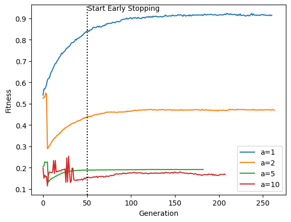
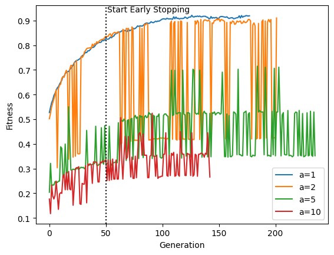

# Lab 9 Notebook Report: Comparative Analysis of Evolutionary Algorithm Selection Strategies

## Algorithm Description

The algorithm implements a standard evolutionary approach with the following steps:
- Initialization of a population of individuals.
- Calculation of fitness for each individual.
- Selection of parents for the next generation.
- Crossover and mutation to generate offspring.
- Creation of a new population and iteration over multiple generations.

## Selection Strategies Compared

1. **Fitness-Based Selection**: 
   - Parents are selected based on their fitness values.
   - Aims to directly optimize the problem's fitness function.

2. **Count of Ones-Based Selection**: 
   - Selection is based on the number of ones in the individual's genome.
   - This approach does not directly relate to the fitness function of the problem but focuses on a genetic feature of the individuals.

# Results and Analysis

## Comparison Table

| Problem | Strategy | Best Fitness | Generation of Best Fitness | Total Generations | Fitness Calls | Population Size |
|---------|----------|--------------|----------------------------|-------------------|---------------|-----------------|
| Problem 1 | Fitness-Based | 0.924 | 209 | 261 | 26100 | 100 |
| Problem 1 | Count of Ones-Based | 0.921 | 126 | 178 | 17800 | 100 |
| Problem 2 | Fitness-Based | 0.55 | 3 | 264 | 26400 | 100 |
| Problem 2 | Count of Ones-Based | 0.91 | 201 | 202 | 20200 | 100 |
| Problem 5 | Fitness-Based | 0.227516 | 2 | 183 | 18300 | 100 |
| Problem 5 | Count of Ones-Based | 0.7149 | 184 | 236 | 23600 | 100 |
| Problem 10 | Fitness-Based | 0.253724508 | 29 | 208 | 20800 | 100 |
| Problem 10 | Count of Ones-Based | 0.5242343 | 91 | 143 | 14300 | 100 |

## Plot
Fitness based strategy:

Count of ones based strategy:

## Observations

- **Fitness-Based Strategy**: This strategy shows varied performance across different problems. It achieved its best performance on Problem 1 with a fitness of 0.924.
- **Count of Ones-Based Strategy**: Generally requires fewer fitness calls than the fitness-based strategy. It shows a notably higher fitness in Problems 2, 5, and 10 compared to the fitness-based strategy.
- **Efficiency**: While the fitness-based strategy directly optimizes the problem's fitness function, the count of ones-based strategy, focusing on a genetic characteristic, shows efficiency in certain problems with fewer fitness calls and higher best fitness values in some cases.

### Peer review

Done:
- [To Lorenzo Bonannella](https://github.com/lorenzobn/computational_intelligence/issues/3#issue-2032325924) [(lorenzobn)](https://github.com/lorenzobn)
- [To Salvatore Tilocca](https://github.com/TiloccaS/computational-intelligence-2023-24/issues/3#issue-2032614070) [(TiloccaS)](https://github.com/TiloccaS)

Received:
- [From Lorenzo Bonannella](https://github.com/Aleedm/computational-intelligence/issues/5#issue-2032175407) [(lorenzobn)](https://github.com/lorenzobn)
