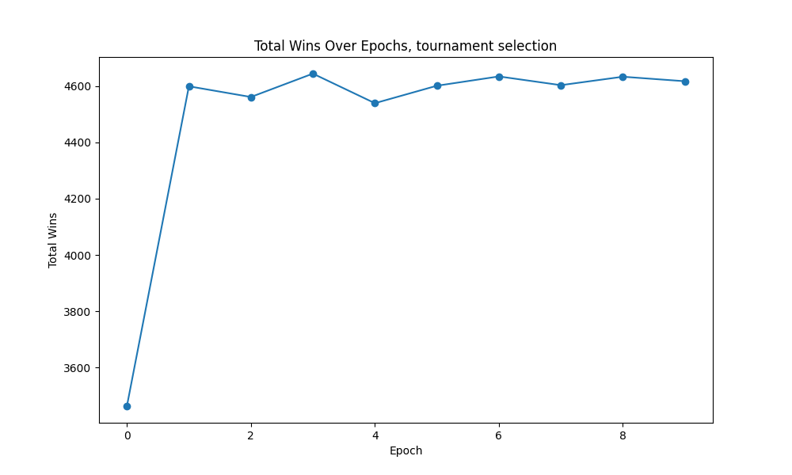
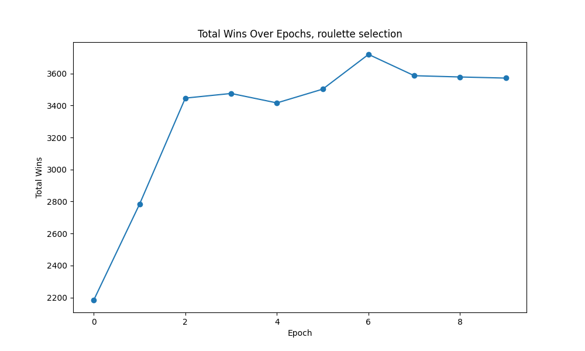
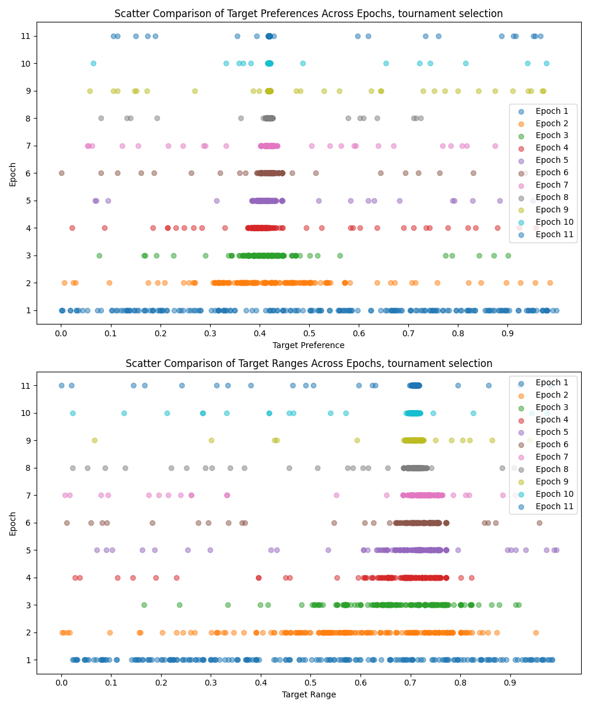
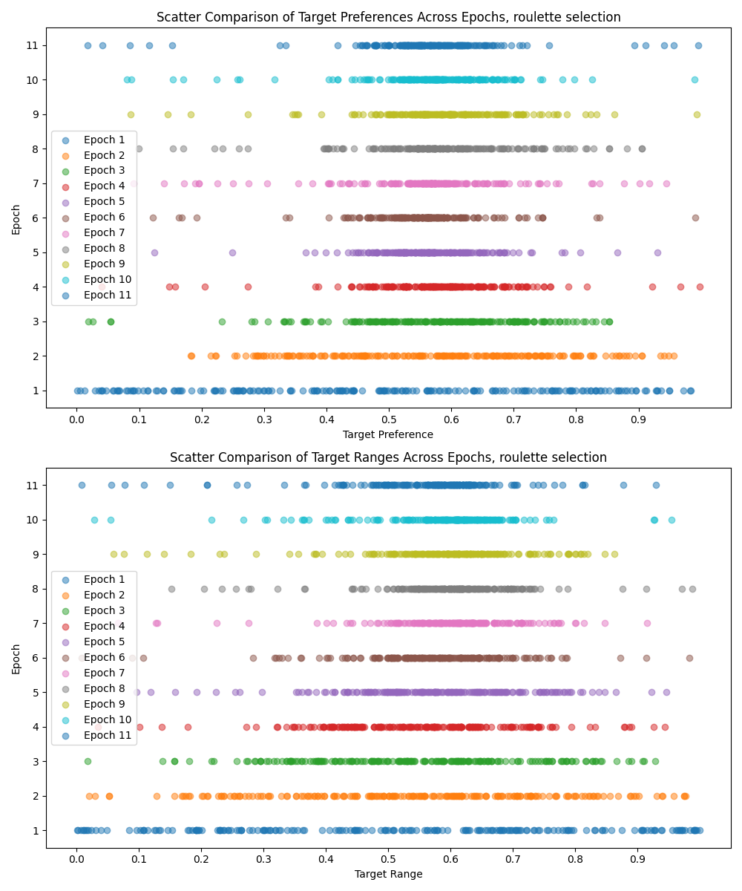
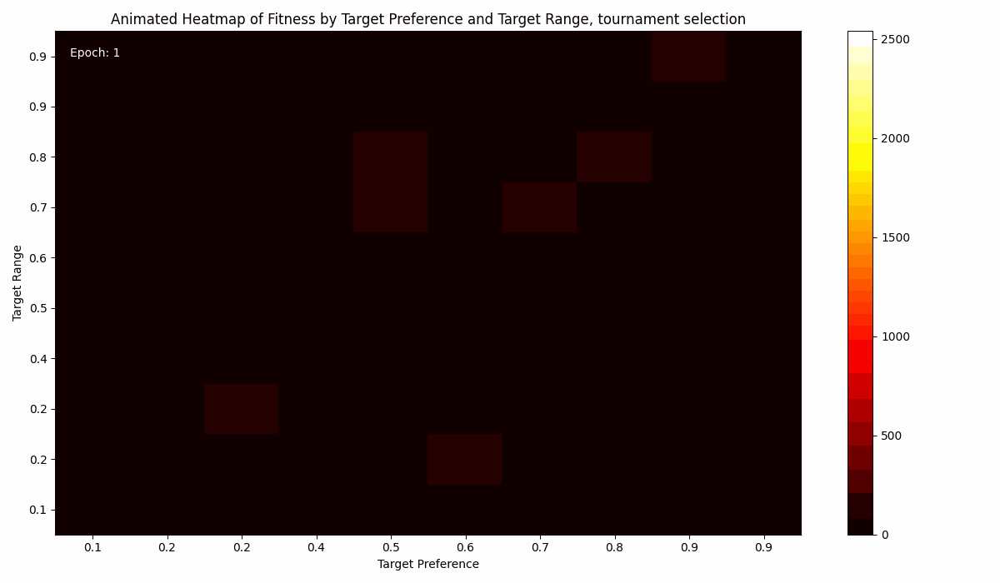
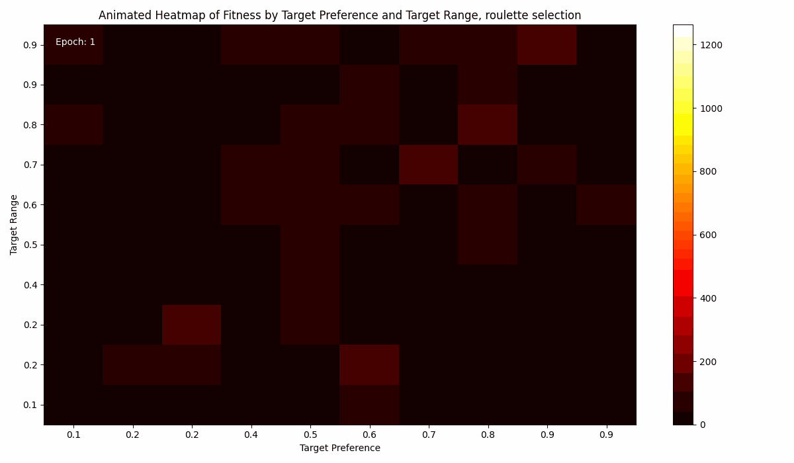

## Genetic Algorithm for Nim Game

### Genome Structure
The genome in this genetic algorithm represents the strategy of an individual for playing Nim. It consists of two key attributes:

1. **`target_preference`**: A float between 0 and 1 indicating the individual's preferred `nim_sum` value after making a move. It represents a strategy bias towards a certain game state.

2. **`target_range`**: Another float between 0 and 1, indicating the acceptable range of `nim_sum` values around the `target_preference`. This attribute allows the individual to be flexible in their strategy.

Each individual also has a `fitness` attribute, representing their success in the game, measured by the number of wins.

### Selection Methods
Two selection methods were implemented and compared:

1. **Roulette Wheel Selection**: In this method, individuals are selected based on their fitness proportionate to the total fitness of the population. This approach gives higher fitness individuals a better chance of being selected, but still allows for the selection of lower fitness individuals, maintaining diversity in the population.

2. **Tournament Selection**: Here, a subset of the population is randomly chosen, and the individual with the highest fitness in this subset is selected. This method can potentially favor selecting only the highest fitness individuals, which might lead to premature convergence.

### Comparison of Results
The performance of the genetic algorithm using these two selection methods can vary based on several factors:

- **Diversity Maintenance**: Roulette wheel selection might maintain more diversity within the population compared to tournament selection.

- **Convergence Speed**: Tournament selection might converge faster to a high-fitness solution but at the risk of getting stuck in local optima.

### Total wins over epochs

### Genome diversity over epochs

### Wins over genome diversity through epochs

### Peer review

Done:
- [To Lorenzo Bonannella](https://github.com/lorenzobn/computational_intelligence/issues/1#issue-1994520298) [(lorenzobn)](https://github.com/lorenzobn)

Received:
- [From Lorenzo Bonannella](https://github.com/Aleedm/computational-intelligence/issues/1#issue-1994496255) [(lorenzobn)](https://github.com/lorenzobn)