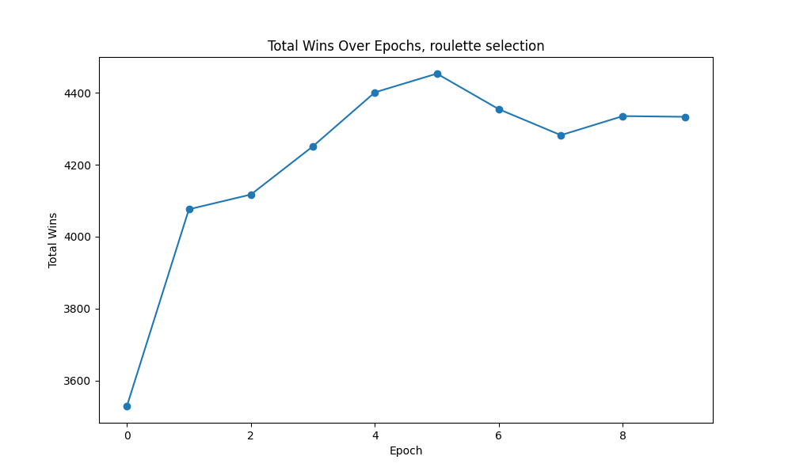
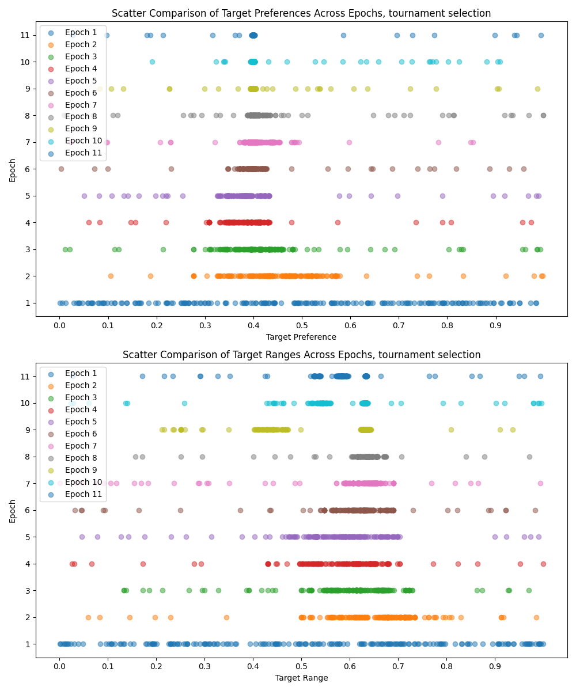
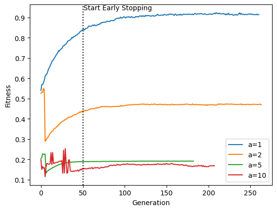

# Table of Contents
1. [Lab 1](#lab-1)
2. [Lab 2 + Contribution](#lab-2--contribution)
    1. [Genome Structure](#genome-structure)
    2. [Selection Methods](#selection-methods)
    3. [Comparison of Results](#comparison-of-results)
    4. [Total wins over epochs](#total-wins-over-epochs)
    5. [Genome diversity over epochs](#genome-diversity-over-epochs)
    6. [Wins over genome diversity through epochs](#wins-over-genome-diversity-through-epochs)
    7. [Peer review](#peer-review)
4. [Lab 3](#lab-3)
    1. [Comparative Analysis of Evolutionary Algorithm Selection Strategies](#comparative-analysis-of-evolutionary-algorithm-selection-strategies)
        1. [Algorithm Description](#algorithm-description)
        2. [Selection Strategies Compared](#selection-strategies-compared)
    2. [Results and Analysis](#results-and-analysis)
        1. [Comparison Table](#comparison-table)
        2. [Plot](#plot)
        3. [Observations](#observations)
        4. [Peer review](#peer-review-1)
5. [Lab 4](#lab-4)
6. [Quixo](#quixo)
   1. [Minimax-Based Agent](#minimax-based-agent)
   2. [NEAT-Based Agent](#neat-based-agent)
   3. [AlphaZero Agent for Quixo Game](#alphazero-agent-for-quixo-game)

# Lab 1
```python
from random import random
from functools import reduce
from collections import namedtuple
from queue import PriorityQueue, SimpleQueue, LifoQueue

import numpy as np

PROBLEM_SIZE = 5
NUM_SETS = 10
SETS = tuple(
    np.array([random() < 0.3 for _ in range(PROBLEM_SIZE)])
    for _ in range(NUM_SETS)
)
State = namedtuple('State', ['taken', 'not_taken'])

def goal_check(state):
    return np.all(reduce(
        np.logical_or,
        [SETS[i] for i in state.taken],
        np.array([False for _ in range(PROBLEM_SIZE)]),
    ))


def distance(state):
    return PROBLEM_SIZE - sum(
        reduce(
            np.logical_or,
            [SETS[i] for i in state.taken],
            np.array([False for _ in range(PROBLEM_SIZE)]),
        ))


assert goal_check(
    State(set(range(NUM_SETS)), set())
), "Probelm not solvable"

frontier = PriorityQueue()
state = State(set(), set(range(NUM_SETS)))
steps = 0
frontier.put((0 + distance(state), state))

_, current_state = frontier.get()
while not goal_check(current_state):
    steps += 1
    for action in current_state.not_taken:
        g = len(current_state.taken)
        new_state = State(
            current_state.taken ^ {action},
            current_state.not_taken ^ {action},
        )
        frontier.put((g+distance(new_state), new_state))
    _, current_state = frontier.get()

print(
    f"Solved in {steps:,} steps ({len(current_state.taken)} tiles)"
)
```

# Lab 2 + Contribution

## Contribution
I contributed by creating a PowerPoint presentation that illustrates my original solution to the Nim problem, the PDF can be found at [this link](https://github.com/Aleedm/computational-intelligence/blob/main/nim_game/ES_nim_game.pdf)

## Genetic Algorithm for Nim Game

### Genome Structure
The genome in this genetic algorithm represents the strategy of an individual for playing Nim. It consists of two key attributes:

1. **`target_preference`**: A float between 0 and 1 indicating the individual's preferred `nim_sum` value after making a move. It represents a strategy bias towards a certain game state.

2. **`target_range`**: Another float between 0 and 1, indicating the acceptable range of `nim_sum` values around the `target_preference`. This attribute allows the individual to be flexible in their strategy.

Each individual also has a `fitness` attribute, representing their success in the game, measured by the number of wins.

### Selection Methods
Two selection methods were implemented and compared:

1. **Roulette Wheel Selection**: In this method, individuals are selected based on their fitness proportionate to the total fitness of the population. This approach gives higher fitness individuals a better chance of being selected, but still allows for the selection of lower fitness individuals, maintaining diversity in the population.

2. **Tournament Selection**: Here, a subset of the population is randomly chosen, and the individual with the highest fitness in this subset is selected. This method can potentially favor selecting only the highest fitness individuals, which might lead to premature convergence.

### Comparison of Results
The performance of the genetic algorithm using these two selection methods can vary based on several factors:

- **Diversity Maintenance**: Roulette wheel selection might maintain more diversity within the population compared to tournament selection.

- **Convergence Speed**: Tournament selection might converge faster to a high-fitness solution but at the risk of getting stuck in local optima.

### Total wins over epochs




### Genome diversity over epochs




## Peer review

Done:
- [To Lorenzo Bonannella](https://github.com/lorenzobn/computational_intelligence/issues/1#issue-1994520298) [(lorenzobn)](https://github.com/lorenzobn)
- [To Giacomo Cauda](https://github.com/jackcauda00/computational-intelligence/issues/1#issue-1996474845) [(jackcauda00)](https://github.com/jackcauda00)

Received:
- [From Lorenzo Bonannella](https://github.com/Aleedm/computational-intelligence/issues/1#issue-1994496255) [(lorenzobn)](https://github.com/lorenzobn)
- [From SaSa0011](https://github.com/Aleedm/computational-intelligence/issues/2#issue-1995292998) [(SaSa0011)](https://github.com/SaSa0011)
- [From Giacomo Cauda](https://github.com/Aleedm/computational-intelligence/issues/3#issue-2005998726) [(jackcauda00)](https://github.com/jackcauda00)
- [From loregrc](https://github.com/Aleedm/computational-intelligence/issues/4#issue-2009605848) [(loregrc)](https://github.com/loregrc)

# Lab 3

## Comparative Analysis of Evolutionary Algorithm Selection Strategies

### Algorithm Description

The algorithm implements a standard evolutionary approach with the following steps:
- Initialization of a population of individuals.
- Calculation of fitness for each individual.
- Selection of parents for the next generation.
- Crossover and mutation to generate offspring.
- Creation of a new population and iteration over multiple generations.

### Selection Strategies Compared

1. **Fitness-Based Selection**: 
   - Parents are selected based on their fitness values.
   - Aims to directly optimize the problem's fitness function.

2. **Count of Ones-Based Selection**: 
   - Selection is based on the number of ones in the individual's genome.
   - This approach does not directly relate to the fitness function of the problem but focuses on a genetic feature of the individuals.

## Results and Analysis

### Comparison Table

| Problem | Strategy | Best Fitness | Generation of Best Fitness | Total Generations | Fitness Calls | Population Size |
|---------|----------|--------------|----------------------------|-------------------|---------------|-----------------|
| Problem 1 | Fitness-Based | 0.924 | 209 | 261 | 26100 | 100 |
| Problem 1 | Count of Ones-Based | 0.921 | 126 | 178 | 17800 | 100 |
| Problem 2 | Fitness-Based | 0.55 | 3 | 264 | 26400 | 100 |
| Problem 2 | Count of Ones-Based | 0.91 | 201 | 202 | 20200 | 100 |
| Problem 5 | Fitness-Based | 0.227516 | 2 | 183 | 18300 | 100 |
| Problem 5 | Count of Ones-Based | 0.7149 | 184 | 236 | 23600 | 100 |
| Problem 10 | Fitness-Based | 0.253724508 | 29 | 208 | 20800 | 100 |
| Problem 10 | Count of Ones-Based | 0.5242343 | 91 | 143 | 14300 | 100 |

### Plot
Fitness based strategy:


Count of ones based strategy:


### Observations

- **Fitness-Based Strategy**: This strategy shows varied performance across different problems. It achieved its best performance on Problem 1 with a fitness of 0.924.
- **Count of Ones-Based Strategy**: Generally requires fewer fitness calls than the fitness-based strategy. It shows a notably higher fitness in Problems 2, 5, and 10 compared to the fitness-based strategy.
- **Efficiency**: While the fitness-based strategy directly optimizes the problem's fitness function, the count of ones-based strategy, focusing on a genetic characteristic, shows efficiency in certain problems with fewer fitness calls and higher best fitness values in some cases.

## Peer review

Done:
- [To Lorenzo Bonannella](https://github.com/lorenzobn/computational_intelligence/issues/3#issue-2032325924) [(lorenzobn)](https://github.com/lorenzobn)
- [To Salvatore Tilocca](https://github.com/TiloccaS/computational-intelligence-2023-24/issues/3#issue-2032614070) [(TiloccaS)](https://github.com/TiloccaS)

Received:
- [From Lorenzo Bonannella](https://github.com/Aleedm/computational-intelligence/issues/5#issue-2032175407) [(lorenzobn)](https://github.com/lorenzobn)
- [From LorenzoUgo](https://github.com/Aleedm/computational-intelligence/issues/6#issue-2034399036) [(LorenzoUgo)](https://github.com/LorenzoUgo)

# Lab 4

## Overview of Tic-Tac-Toe AI Implementation

This Python script presents an Reinforcement Learning implementation for the classic game of Tic-Tac-Toe, using two primary methods: Q-Learning and Monte Carlo simulations. It's designed to train AI models to play Tic-Tac-Toe, compete against each other, and even play against a human.

## Key Components

1. **State Definition**: A `State` named tuple defines the game state, holding positions of 'X' and 'O', and the current turn.
2. **Q-Learning Implementation**: Utilizes a reinforcement learning approach for training the AI.
3. **Monte Carlo Implementation**: Employs Monte Carlo methods for a different AI training approach.
4. **Game Simulation and Training**: Functions to simulate games, train the AI models, and evaluate the outcomes.
5. **Utility Functions**: Includes functions for printing the board, checking wins, and normalizing weights.
6. **Result Analysis**: Code to compete AIs against each other and analyze the results with various plots.

## Training Process

- The script trains two AI agents using Q-Learning and Monte Carlo methods over `10,000,000` episodes.
- Adjusts hyperparameters like `learning_rate` and `discount_factor` to optimize learning.

## Competing the AI Models

- The models compete in `100,000` games.
- Functions like `compete` and `update_results` manage these competitions and track the outcomes.

## Results and Visualization

- The script includes functions to plot the outcomes of the competitions, such as win/loss/draw ratios, outcomes based on who starts first, and the distribution of wins and draws over turns.
- These visualizations are essential for analyzing the performance and strategies of the AI models.

## Interactive Play

- The script also allows a human player to play against the AI, offering an interactive way to test the AI's skills.

---

## Results

Here are the visual results from the AI competitions between Monte Carlo and Q-Learning models, as well as their performance against a random opponent.

### Monte Carlo vs Q-Learning

#### Total Game Outcomes


#### Outcomes by Starting Agent


#### Wins and Draws by Turns


### Monte Carlo vs Random

#### Total Game Outcomes


#### Outcomes by Starting Agent


#### Wins and Draws by Turns


### Q-Learning vs Random

#### Total Game Outcomes


#### Outcomes by Starting Agent


#### Wins and Draws by Turns


---

## Conclusion

This implementation demonstrates the effectiveness of Q-Learning and Monte Carlo methods in developing Reinforcement Learning for simple strategy games like Tic-Tac-Toe. The results and visualizations provide insights into AI strategies and decision-making processes.

---

## Peer review

Done:
- [To Lorenzo Bonannella](https://github.com/lorenzobn/computational_intelligence/issues/6#issue-2064241100) [(lorenzobn)](https://github.com/lorenzobn)
- [To Riccardo Cardona](https://github.com/Riden15/Computational-Intelligence/issues/6#issue-2064258067) [(Riden15)](https://github.com/Riden15)

Received:
- [From Lorenzo Bonannella](https://github.com/Aleedm/computational-intelligence/issues/7#issue-2062761403) [(lorenzobn)](https://github.com/lorenzobn)
- [From Giacomo Cauda](https://github.com/Aleedm/computational-intelligence/issues/8#issue-2067887634) [(jackcauda00)](https://github.com/jackcauda00)


# Quixo

## Abstract
The aim of this project is to develop an intelligent agent capable of playing Quixo, a two-player strategy board game. The agent has been implemented using three distinct techniques: Minimax, NEAT, and a model inspired by AlphaZero.

## Introduction
The agents were implemented using three different techniques:

- Minimax: A search algorithm that identifies the best move in a two-player game with perfect information. A variant incorporating alpha-beta pruning was implemented to reduce the number of searches needed.
- NEAT (NeuroEvolution of Augmenting Topologies): A neuroevolution algorithm that trains a neural network using an evolutionary approach. The evolutionary algorithm adjusts both the structure and weights of the neural network (implemented with PyTorch) to maximize its performance.
- AlphaZero: A deep reinforcement learning model that trains a neural network using a reinforcement learning algorithm. The algorithm employs a Monte Carlo Tree Search to find the best move, using the neural network's outputs as policy and value guidance.

## Minimax-Based Agent

### Theoretical Background
The Minimax algorithm is a decision-making algorithm used in game theory and artificial intelligence. It provides a way for players to minimize the possible loss in a worst-case scenario. When applied to games like Quixo, the algorithm simulates all possible moves and their outcomes, and then chooses the move that maximizes the player's chances of winning.

Alpha-beta pruning is an optimization technique for the Minimax algorithm. It reduces the number of nodes evaluated by the Minimax algorithm in its search tree. This is achieved by stopping the evaluation of a move when at least one possibility has been found that proves the move to be worse than a previously examined move. Inoltre alpha-beta permette di ottenere buoni risultati in tempi ragionevoli evitando di esplorare tutto l'albero di ricerca, cosa difficile da fare in giochi complessi come Quixo.

### Implementation
The Minimax algorithm is implemented in Python as a class `MinMaxPlayer`, inheriting from the `Player` class. It includes methods for making a move (`make_move`), running the Minimax algorithm (`minimax`), and evaluating the game state (`evaluate_game`).

#### `make_move` Method
This method determines the best move to make in the current game state. It iterates through all possible moves and evaluates them using the `minimax` method. The move with the highest score is chosen as the best move. If no best move is found, a random move is chosen.

#### `minimax` Method
This recursive method is the core of the Minimax algorithm. It evaluates the game state and decides the best move by simulating all possible outcomes. The method incorporates alpha-beta pruning to improve efficiency.

```python
def minimax(self, game, depth, alpha, beta, is_maximizing):
        # Minimax algorithm with alpha-beta pruning
        current_player = game.get_current_player()
        if depth == 0 or game.check_winner() != -1:
            # Evaluate the game if it's at max depth or a winner is found
            return self.evaluate_game(game)

        if is_maximizing:
            max_eval = float("-inf")
            for move in get_possible_moves(game.get_board(), current_player, random=True):
                # Clone the game and make the move
                cloned_game = game.clone()
                cloned_game.move(move[0], move[1], current_player)

                # Recursive call to minimax
                evaluation = self.minimax(cloned_game, depth - 1, alpha, beta, False)
                max_eval = max(max_eval, evaluation)
                alpha = max(alpha, evaluation)
                if beta <= alpha:
                    break
            return max_eval
        else:
            min_eval = float("inf")
            for move in get_possible_moves(game.get_board(), current_player, random=True):
                # Similar to the maximizing player, but minimizing the score
                cloned_game = game.clone()
                cloned_game.move(move[0], move[1], current_player)
                evaluation = self.minimax(cloned_game, depth - 1, alpha, beta, True)
                min_eval = min(min_eval, evaluation)
                beta = min(beta, evaluation)
                if beta <= alpha:
                    break
            return min_eval

```

#### `evaluate_game` Method
This method evaluates the current game state and returns a score. The scoring is simple: 0 for a tie, 1 for a win, and -1 for a loss.


### Result
The Minimax agent demonstrated effective gameplay in Quixo, winning the majority of matches against a random opponent. This agent achieved a win rate of 90% against a random opponent. The average duration of each game was approximately 1.5 seconds, with the search depth set to 5.


## NEAT-Based Agent
NEAT is an evolutionary algorithm that creates and optimizes neural network architectures. Unlike traditional neural networks, it not only adjusts the weights of the connections but also dynamically alters the network's structure. This process, which involves evolutionary algorithms for mutation and crossover, makes the network more adaptable to the task at hand.

### Genome Structure
The genome in this NEAT implementation encapsulates both the architecture and the weights of the neural network. Each genome is a sequence of genes, where each gene defines a layer in the neural network. The components of a gene are:
- Input and output sizes of the layer.
- Weights matrix: Dictates the strength of connections between neurons.
- Bias vector: Provides offsets for each neuron in the layer.
The structure of the genome can be visualized as a sequence of layers, with each layer being a gene. A simplified representation is as follows:

``` yaml
Genome: [Layer1, Layer2, ..., LayerN]
Layer: {
    Input Size,
    Output Size,
    Weights: [ [w11, w12, ...], [...], ... ],
    Bias: [b1, b2, ..., bN]
}
```
To prevent the creation of excessively large neural networks, limits were set on both the number of layers and the number of neurons per layer due to computational resource constraints.

### Neural Network Model
The neural network model is fully connected, meaning each neuron in a layer is connected to every neuron in the subsequent layer. This architecture ensures a thorough flow of information throughout the network.
```python
class Model(nn.Module):
    def __init__(self, genome):
        super(Model, self).__init__()

        # Create dinamically the intermediate layers based on the genome
        self.layers = nn.ModuleList()
        for i in range(len(genome)):
            input_size, output_size, weights, bias = genome[i]
            layer = nn.Linear(input_size, output_size)

            # Set weights and bias
            with torch.no_grad():
                layer.weight = nn.Parameter(torch.tensor(weights, dtype=torch.float32))
                layer.bias = nn.Parameter(torch.tensor(bias, dtype=torch.float32))

            self.layers.append(layer)

    def forward(self, x):
        # Forward pass through each intermediate layer
        for layer in self.layers:
            # Apply ReLU as activation function
            x = torch.relu(layer(x))

        # Apply softmax to the output layer
        return torch.softmax(x, dim=0)
```

### Simulation
During each generation, every individual neural network in the population competes against randomly selected opponents from the same group. This method ensures a variety of gameplay experiences, assessing each network's adaptability and strategy robustness. The individuals' performance is evaluated based on their success in these games, quantified as a fitness score.

### Mutation
The mutation process introduces random changes to the genome, affecting both the network's structure and its weights. The types of mutation include:
- Adding or removing a layer, increasing or decreasing network complexity.
    - **Layer Addition/Removal:** Layers can be randomly added between existing ones or removed.
- Adjusting the size of a layer by changing the number of neurons.
    - **Layer Resizing:** The number of neurons in a layer can be increased or decreased as necessary.
- Slight modifications to the existing weights and biases.
    - **Parameter Tweaking:** Individual weights and biases are subtly adjusted.

### Crossover
Crossover merges genes from two parent genomes to produce a new genome. This involves:
- Determining the number of layers in the child genome.
    - **Layer Numbers:** The child's layer count is randomly chosen, ranging from the parent with the fewest layers to the sum of both parents' layers minus the shared layers, namely input and output.
- Choosing layers from each parent, ensuring input and output size compatibility.
    - **Layer Selection:** A layer is randomly selected from one of the parents, respecting the layer order, and repeated until the child genome's layer count is reached.
- Combining weights and biases from the parents to create new layers.
    - **Parameter Mixing:** Weights and biases are blended from the chosen layers of both parents.

### Results
Unfortunately, with the hardware at my disposal, I was unable to train NEAT as I intended. I attempted to run the code for a few generations, limiting the number of individuals per generation, the games played per generation, and the complexity of the neural network. Despite all these constraints, I achieved interesting results, with a winning rate of 70% against a random opponent. These results are exciting, and it would be interesting to see how the agent performs if trained without all these limitations.


## AlphaZero Agent for Quixo Game
AlphaZero, a groundbreaking AI developed by DeepMind, has made significant advances in the field of artificial intelligence, notably defeating the world-renowned chess engine Stockfish. In our project, we adapt the principles of AlphaZero to develop a sophisticated agent for the Quixo game.

### Theoretical Background of AlphaZero
AlphaZero employs a unique combination of deep neural networks and a Monte Carlo Tree Search (MCTS) to master games like Chess, Go, and Shogi. Unlike traditional algorithms, it learns solely from self-play, without any prior knowledge or human intervention. This approach allows AlphaZero to discover and refine strategies, continuously improving its gameplay.

### Convolutional Neural Network Model
The core of our AlphaZero implementation is a deep convolutional neural network, designed to evaluate Quixo game states and predict the best moves. The network comprises an initial convolutional layer followed by several residual blocks, which help in preserving information throughout the network. The network outputs both policy (move probabilities) and value (game outcome predictions) heads, crucial for guiding the MCTS.

```python
class ResidualBlock(nn.Module):
    def __init__(self, channels):
        super(ResidualBlock, self).__init__()
        self.conv1 = nn.Conv2d(channels, channels, kernel_size=3, padding=1)
        self.bn1 = nn.BatchNorm2d(channels)
        self.conv2 = nn.Conv2d(channels, channels, kernel_size=3, padding=1)
        self.bn2 = nn.BatchNorm2d(channels)

    def forward(self, x):
        residual = x
        out = F.relu(self.bn1(self.conv1(x)))
        out = self.bn2(self.conv2(out))
        out += residual  # Adding the residual value
        return F.relu(out)

class QuixoNet(nn.Module):
    def __init__(self):
        super(QuixoNet, self).__init__()

        self.conv_initial = nn.Conv2d(2, 256, kernel_size=3, padding=1)
        self.bn_initial = nn.BatchNorm2d(256)

        # Creating 10 residual blocks
        self.res_blocks = nn.Sequential(
            ResidualBlock(256),
            ResidualBlock(256),
            ResidualBlock(256),
            ResidualBlock(256),
            ResidualBlock(256),
            ResidualBlock(256),
            ResidualBlock(256),
            ResidualBlock(256),
            ResidualBlock(256),
            ResidualBlock(256),
        )

        # Defining the output layers
        self.fc_val = nn.Linear(256, 1)  # Value head
        self.fc_pol = nn.Linear(256, 44)  # Policy head

    def forward(self, x):
        x = F.relu(self.bn_initial(self.conv_initial(x)))
        x = self.res_blocks(x)
        x = F.avg_pool2d(x, x.size()[2:])  # Global average pooling
        x = x.view(x.size(0), -1)  # Flattening

        # Calculating value and policy predictions
        val = torch.tanh(self.fc_val(x))  # Value prediction
        pol = F.log_softmax(self.fc_pol(x), dim=1)  # Policy prediction

        return pol, val
```


### Concept of Self-Play
Self-play is a critical mechanism in AlphaZero's learning process, where the agent plays games against itself to improve its strategies. This method is revolutionary as it does not rely on historical data or pre-programmed knowledge. Instead, the agent develops its understanding of the game purely through the experience gained from playing against itself.

### Self-Play Process
1. **Initial Phase**: At the start, the neural network knows little about the game. The agent's decisions are mostly random, with a slight bias from the neural network's initial predictions.

2. **Data Generation**: During self-play, every move and decision made by the agent is recorded. This includes the game state, the chosen move, and the predicted outcome of the game at each step. 

3. **Policy and Value Data**: The neural network provides two key outputs for each game state - a policy (probability distribution over possible moves) and a value (an estimation of the game outcome from the current state). This data is crucial for understanding the agent's decision-making process and for training the neural network.

4. **Feedback Loop**: As games are played, the agent gathers a wealth of data. This data is then used to retrain the neural network, improving its move predictions and game outcome estimations.

5. **Iterative Improvement**: The improved network then plays more games against itself, generating better-quality data. This iterative process leads to a continuous cycle of self-improvement.

6. **Diverse Strategies**: Since the AlphaZero agent plays against itself, it encounters and adapts to a variety of strategies and board configurations. This diversity is key to developing a robust and versatile playing style.

### Benefits of Self-Play
- **Independence from Human Knowledge**: The agent is not limited by the extent of human strategies known for the game. It can discover novel strategies and tactics that human players might not have considered.
- **Adaptability and Learning**: The agent continuously adapts and learns from its own gameplay, leading to a deep understanding of the game's nuances.
- **Data Efficiency**: Self-play ensures that the data used for training is both relevant and highly efficient in improving the agent’s performance.

### Challenges in Self-Play
- **Computational Intensity**: The process of playing games, generating data, and retraining the neural network is computationally intensive and requires significant processing power.
- **Balancing Exploration and Exploitation**: Finding the right balance between exploring new strategies and exploiting known successful ones is crucial for effective learning.


### Child Selection in MCTS

In the Monte Carlo Tree Search (MCTS) used by our AlphaZero implementation for Quixo, the selection of a child node is a critical step that determines the direction of the search. This process utilizes the Upper Confidence Bound (UCB) formula to weigh the trade-off between exploring new, potentially promising moves (exploration) and exploiting moves known to yield good outcomes (exploitation). The specific formula applied in the selection process is tailored to integrate both the value of the node and the policy predictions from the neural network.

#### The Selection Formula
The formula used for selecting a child node in our MCTS is as follows:


Where:
- V represents the value of the child node, which is the average result of simulations passing through that node.
- C is a constant that determines the balance between exploration and exploitation, set based on empirical testing or domain knowledge. In the provided code, C is set to 1.41, aligning with the square root of 2, a common choice in practice.
- P is the move probability assigned by the neural network, indicating the likelihood of choosing that move.
- N denotes the total number of visits to the current node (parent node of the child being evaluated).
- n is the number of visits to the child node.

#### Detailed Explanation
- **Value (V) Component**: Reflects the historical success of the node. A higher value indicates a path that has led to favorable outcomes in past simulations.
- **Exploration Term**: The term C x P x sqrt(log(N)/n) balances exploration and exploitation. The multiplication by the move probability P ensures that moves deemed more promising by the neural network are preferred.
- **Adjustment for Parent and Child Visits**: The ratio of log(N) over n increases as the child node is visited less frequently compared to its siblings, promoting exploration of less-visited nodes.

```python
def select_child(self, C=1.41):
        # Select the best child node using the Upper Confidence Bound (UCB) formula
        best_child = None
        best_ucb = float("-inf")  # Initialize the best UCB as negative infinity

        # Iterate through each child to find the child with the highest UCB
        for child in self.children:
            V = child.value  # The average value of the child node
            P = child.move_prob  # Probability of the move as predicted by the model
            N = self.visits if self.visits > 0 else 1  # Usa almeno 1 per evitare log(0)
            n = (
                child.visits if child.visits > 0 else 1
            )  # Usa almeno 1 per evitare divisione per 0

            # Calculate the UCB value
            ucb = V + C * P * math.sqrt(math.log(N) / n)
            if ucb > best_ucb:
                best_ucb = ucb
                best_child = child

        return best_child  # Return the best child
```

### MCTS Simulation
Each MCTS simulation involves four steps: selection, expansion, simulation (rollout), and backpropagation. The process starts at the root node and traverses down the tree based on UCB values until a leaf node is reached. The leaf node is then expanded, and the neural network evaluates the new nodes. The simulation step uses the neural network's value head to predict the game outcome, which is then backpropagated up the tree to update the node values.

### Training Data and Dataset
Our neural network's training data, crucial for the AlphaZero agent's mastery of Quixo, is sourced from self-play—a process where the agent plays games against itself. This method ensures a steady influx of fresh game scenarios, capturing the agent's evolving strategies and decisions.

### Continuous Dataset Expansion and Pruning
As the agent accumulates experience, the dataset grows, incorporating new, strategically rich game states. To maintain high data quality and relevance, older entries—reflecting the agent's earlier, less sophisticated gameplay—are periodically pruned. This selective removal process keeps the dataset focused and efficient, containing only the most instructive game scenarios that mirror the agent's current understanding.

```python
def add_data_and_keep_fixed(self, new_game_states, new_val_labels, new_pol_labels, fixed_num):
        # Keep a fixed number of existing data randomly
        if len(self.game_states) > fixed_num:
            indices = list(range(len(self.game_states)))
            random.shuffle(indices)
            keep_indices = set(indices[:fixed_num])

            self.game_states = [self.game_states[i] for i in keep_indices]
            self.val_labels = [self.val_labels[i] for i in keep_indices]
            self.pol_labels = [self.pol_labels[i] for i in keep_indices]

        self.add_data(new_game_states, new_val_labels, new_pol_labels)
```

This dynamic approach to dataset management ensures that the neural network trains on high-quality, relevant data. By continually updating the dataset with recent games and pruning outdated information, the training material remains aligned with the agent's improving skill level, fostering an effective and focused learning environment.

### Results
Similarly to NEAT, I was unable to train AlphaZero due to hardware constraints. The computational power required to train a model using self-play is quite substantial. The AlphaZero paper reports that training the model on 5000 TPUs took 9 hours for 700,000 iterations. Moreover, to train the model effectively, a high number of simulations per move is necessary to get an accurate estimate of the winning probability. For these reasons, I was unable to fully train the model, but I still implemented the agent and conducted some simulations to test it. Given the limitations, I carried out a training regime that allowed me to verify the model's functionality. However, due to the limited number of epochs and simulations, the model achieved a winning rate of 50% against a random player.

It's important to remember that AlphaZero achieved superhuman results in games like chess and Go, so with adequate training, the model would be capable of beating any human player